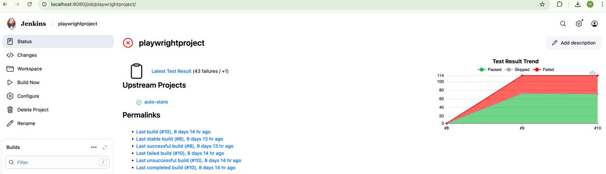

## This project is an automated E to E test written in Playwright covering more than 100 test cases。

##  1. Web UI Automation (Testing)
Playwright is widely used for automating web page testing, including:

- Simulating user actions like clicks, typing, scrolling, and drag-and-drop
- Checking element states (existence, visibility, enabled/disabled)
- Validating page content
- Taking screenshots and generating PDFs

---

##  2. Multi-Browser and Multi-Platform Support
Supports automation on:

- Browsers:
  - Chromium (Chrome, Edge)
  - Firefox
  - WebKit (Safari engine)

- Operating systems:
  - Windows
  - macOS
  - Linux

---

##  3. Mobile Device Emulation
Playwright can emulate mobile devices:

- Set screen sizes and resolutions
- Simulate touch input
- Mock GPS location
- Simulate different network conditions (e.g., 3G, offline)
- Set language and timezone

---

##  4. Data Scraping (Web Crawling)
Although not specifically built for web scraping, Playwright is excellent for scraping dynamic websites:

- Automate login processes
- Handle JavaScript-rendered content
- Interact with the page like a user would to load data
- Intercept network requests to access APIs directly

---

##  5. Automated Form Filling and Submission
Playwright can automate:

- Typing into forms (e.g., username, password, search boxes)
- Submitting forms
- Handling CAPTCHAs (when combined with third-party services)

---

##  6. Network Request Interception and Manipulation
Playwright allows control over network requests and responses:

- Intercept and modify requests
- Mock API responses
- Simulate network failures or delays

---

##  7. User Session and Authentication Handling
Playwright supports managing user sessions:

- Setting and reading cookies
- Managing localStorage and sessionStorage
- Persisting login sessions to avoid repeated logins

---

##  8. Parallel Test Execution and Reporting
With Playwright Test Runner:

- Run multiple tests concurrently to speed up testing
- Automatically capture screenshots and videos on failures
- Generate detailed HTML reports

---

##  9. Continuous Integration (CI/CD) Support
Playwright can be integrated with:

- GitHub Actions
- GitLab CI
- Jenkins and others

##  Email : yajingjiao@icloud.com
